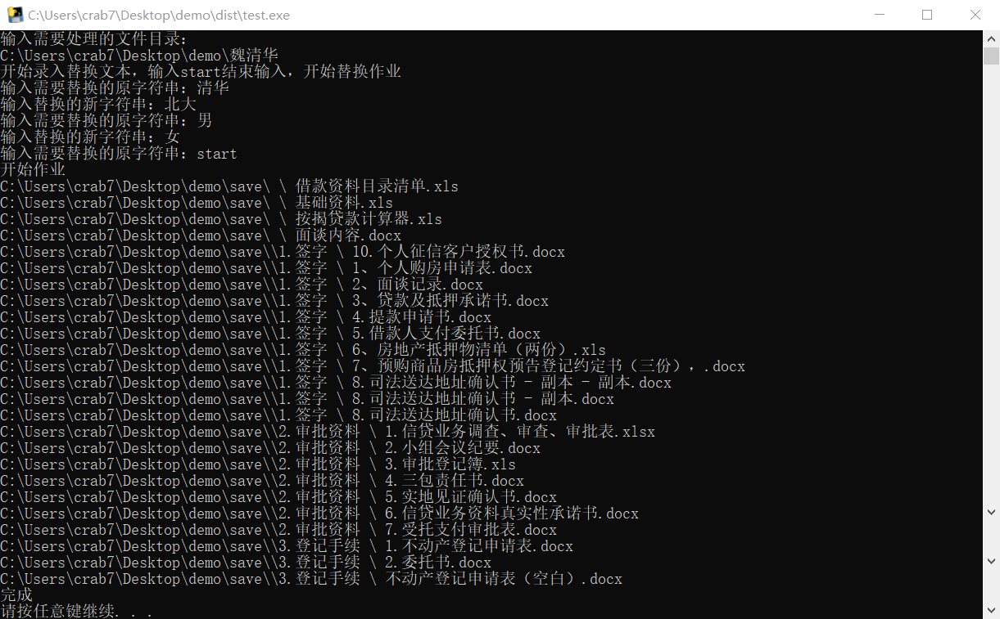
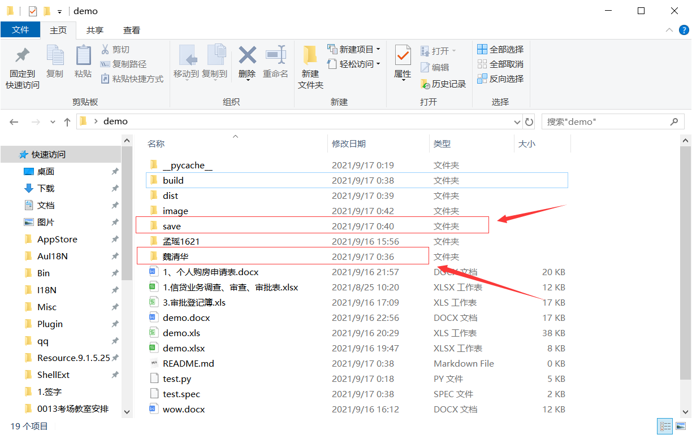

# 使用手册

### 程序功能

将选定文件夹下所有支持格式文件中的指定字符串替换为新的给出字符串，实现批量替换功能

### 支持文件格式

目前该程序仅支持格式为doc、docx、xls、xlsx的文件，其他文件不进行修改

### 使用步骤

1. 打开快捷替换.exe文件

2. 按照提示依次输入对应信息，如下图中所示

   

   根据图中信息可知，首先需要输入处理文件夹的路径（绝对路径），之后会处理其下所有文件（包括子文件夹内）。

   第二步需要输入替换的字符串，按照该规则一组一组输入，当输入完后输入start开始作业。

3. 接下来需要等待程序完成运行，替换后的文件会在与处理文件夹同目录下，文件夹名为save，目录结构一致，非可替换文件会直接复制到对应位置。用途为保留原始文件以免错误替换无法回退。

   

4. 查看替换后的结果，与目标替换一致，完成

5. 如果替换结果有问题或还有新的要替换，则需要将修改save文件夹名，然后再进行修改，因为程序固定替换后的文件夹名为save！！！这非常重要！！

### 补充说明

1. 如果目录中有.doc文件，那么在下一次打开wps时可能会出现打开非常多的文件，此时关闭wps再重新打开即可。

2. 替换规则为任何与原字符串相等的都会替换，所以需要思考好替换哪些词

   如将孟瑶替换成replace；

   ```markdown
   xxx科技有限公司、孟瑶、某单位 -> xxx科技有限公司、replace、某单位
   ```
